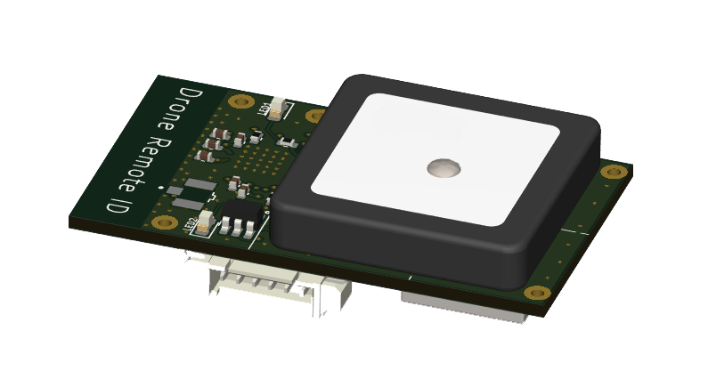

<!-- readme.md -->

### AiSDR Products

[**Xiao301**](/en-us/xiao3.md)
Portable civil Drone Detection Instrument 
- Detect civil drone(DJI ，FPV ) 
- The lightest and smallest drone detection instrument in the world
- The longest operating time(> 20 hours) drone detection instrument in the world

  

[**RemoteID**](/en-us/remodeid.md)
Civil Drone RemoteID Transmitter
- compliant with GB42590-2023(Safety requirements for civil unmanned aircraft system)
- compliant with  ASTM F3586-22,ASTM F3411-22a(Standard Specification for Remote ID and Tracking)
- small size, light weight
- wide voltage range