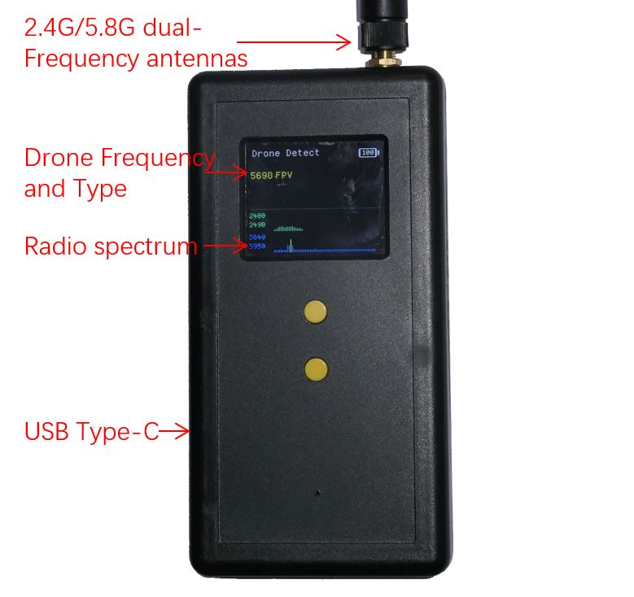

#  Xiao301 - Portable civil Drone Detection Instrument 

Xiao301 is a portable civil drone detection instrument. Xiao301 uses the radio feature analysis technique based on machine learning. Xiao301 receives all radio signals on the 2.4G and 5.8G frequency bands, performs real-time analysis of the radio spectrum characteristics, and issues an alarm sound and vibration alert upon detecting the telemetry signal of a drone (such as DJI drone or FPV drone).

Xiao301 can detect the mainstream civil drones on the market (such as DJI Mavic, DJI Air, DJI M300/M30, FPV drone) video transmiter signal. With no obstruction and interference, the detection distance can reach 1km. It can detect 12 drone targets simultaneously and display the frequency, type, and signal strength. Xiao301 displays the spectrum information in the 2.4G and 5.8G frequency bands in real-time.

Xiao301 has the features of miniaturization, lightweight, and long standby time. Xiao301 is smaller than a regular smartphone. It can be used for more than 20 hours on a single charge, and supports fast charging and charging while in use.    

Xiao301 has a software upgrade function, which can support the detection of new models of drones in the future.  

#  Specification
|   Function    |   Parameter   |
| ----------- | ----------- |
|**Detect DJI Camera Drone**| DJI Mavic，DJI Air，DJI M300/M30，DJI Avata  OcuSync2/3/4|
|**Detect FPV Drone**|FPV Drone using analog video transmiter（40 Channel，A/B/E/F/R Band） FPV Drone using digital video transmiter (OcuSync)|
|**Detection distance [1]**| > 1km|
|**Software upgrade**| support the detection of new models of drones in the future use USB to upgrade
|**Operating Frequency**|2.40-2.49 GHz 5.64-5.95 GHz|
|**Operating Time[2]**|> 20 hours|
|**Alarm mode**|sound alarm vibration alert|
|**Screen**| 1.8 inch high brightness LCD screen|
|**Antenna**|SMA-K（External thread + inner hole） 2.4G and 5.8G dual-frequency antennas, impedance 50ohm|
|**Built-in battery[3]**|Li-ion Type-C 15w fast charging Charge Time: 2 hours Support chargers and power banks charging while in use|
|**Dimensions**|68x24x132mm (L×W×H)(without antenna) two M3 screw holes for mounting back clips
|**Weight**|180± 10 g
|**Footnotes**|[1] The omnidirectional antenna is used and obtained in a good test site and is for reference only. The actual detection is affected by the transmission power of the UAV, the antenna gain of the UAV, whether there is interference, whether there is occlusion, whether there is rain and snow, etc.  [2] The longest working time is tested at room temperature in the laboratory and is for reference only. The actual working time is affected by temperature and other conditions.  [3] The charging time is measured at room temperature in the laboratory and is for reference only|
