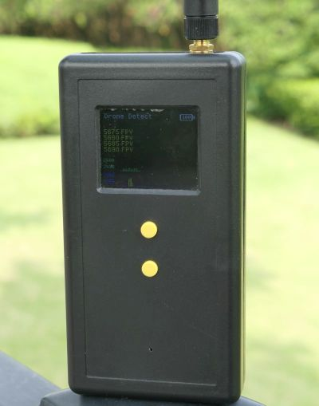
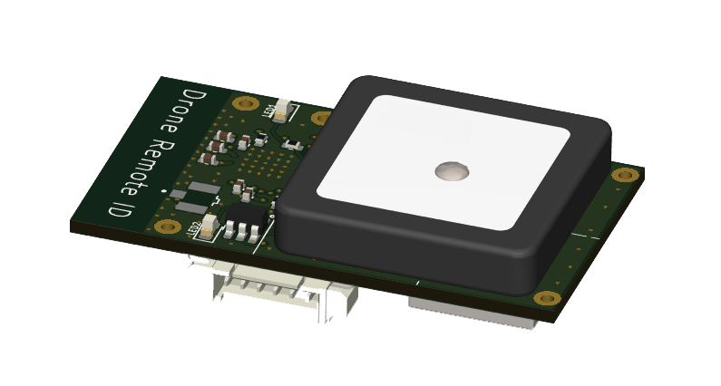

<!-- readme.md -->

### AiSDR(乐凯智能软件无线电)的主要产品

 

[**Xiao301**](/zh-cn/xiao3.md)
民用小型无人机检测仪器  
- 可检测DJI，FPV等主流小型民用无人机
- 小型手持式，业界最轻的无人机检测器
- 工作时间大于20小时，业界待机最长的无人机检测器

  

[**RemoteID**](/zh-cn/remoteid.md)
民用小型无人机远程识别模块
- 符合《民用无人驾驶航空器系统安全要求》（GB42590-2023）中远程识别的功能
- 符合 ASTM F3586-22,ASTM F3411-22a(Standard Specification for Remote ID and Tracking)中远程识别的功能
- 模块体检小，重量轻
- 宽供电电压