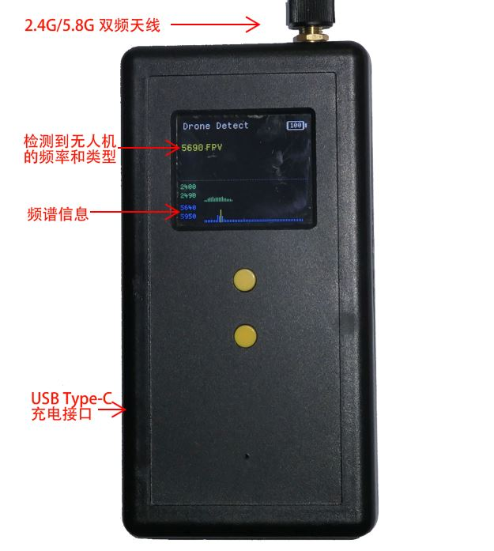

#  Xiao301 - 手持式无人机检测频谱器

Xiao301是一款手持式小型无人机检测仪器，使用了基于机器学习的无线电特征分析技术。 Xiao301会接收2.4G和5.8G频段上的所有无线电信号，实时分析无线电频谱特征，当检测到无人机（DJI drone，FPV drone）的图传信号后，发出告警声音和振动提醒。

Xiao301可以检测市面上的主流航拍无人机（如DJI Mavic，DJI Air，DJI M300/M30），各类FPV无人机的图传信号。在无遮挡和干扰的情况下，探测距离可达1Km。 能同时检测12个无人机目标,并显示的信号频率、类型和信号强度，并能实时显示2.4G和5.8G频段上的频谱信息。

Xiao301具有小型化，轻量化，超长待机的特点。 Xiao301机身比普通智能手机还要小巧。 一次充电可以使用超过20小时，支持快速充电功能，支持边充边用功能。    

Xiao301具有软件升级功能， 通过更新软件，可以支持检测未来出现的新型号无人机。   

#  产品规格
|   功能    |   参数   |
| ----------- | ----------- |
|**检测DJI航拍无人机**| DJI Mavic，DJI Air，DJI M300/M30，DJI Avata  OcuSync2/3/4|
|**检测FPV无人机**|使用模拟图传系统的FPV无人机（40 Channel，A/B/E/F/R Band） 使用OcuSync数字图传的FPV无人机|
|**探测距离[1]**| > 1公里|
|**软件更新**|支持软件更新，以便支持检测未来出现的新型号无人机 使用USB接口升级
|**工作频率**|2.40-2.49 GHz 5.64-5.95 GHz|
|**工作时间[2]**|大于20小时|
|**告警功能**|声音告警 振动告警|
|**屏幕**| 1.8寸高亮LCD屏|
|**天线**|SMA-K（外螺纹+内孔） 2.4G和5.8G双频天线，阻抗50ohm|
|**内置电池[3]**|Li-ion 电池 Type-C快充15w，充电时间2小时 支持充电器和充电宝|
|**机身**|尺寸68x24x132mm (L×W×H)(不含天线) 有2个M3螺孔可以安装背夹
|**重量**|180± 10 g
|**备注**|[1]使用配套的全向天线，在良好的测试场地下得到，仅供参考，实际探测受无人机发射功率、无人机的天线增益、是否有干扰、是否存在遮挡，是否有雨雪等情况影响 [2]最长工作时间在实验室中室温情况下测试得到，实际工作时间受温度等情况影响，仅供参考 [3]充电时间在实验室中室温情况下测试得到，仅供参考|
